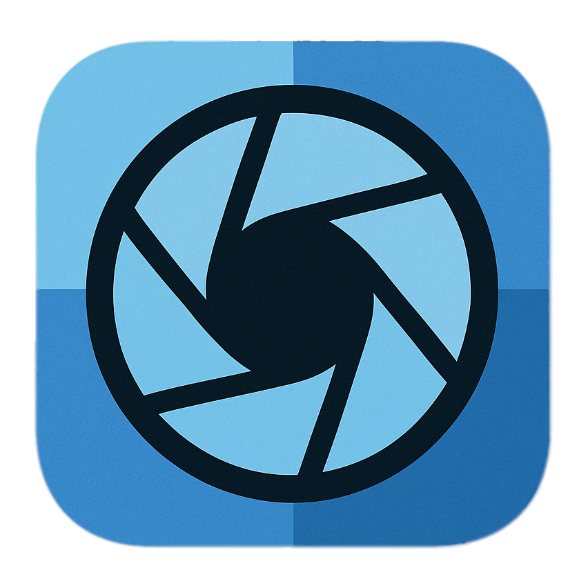

# Photo-pipeline

## Photos

### FastRawViewer

- https://www.fastrawviewer.com/

### DXO PureRAW

- https://www.dxo.com/dxo-pureraw/

### Darktable

- https://www.darktable.org/

### xpano

- https://github.com/krupkat/xpano

### Sequator

- https://sites.google.com/view/sequator/

### exiftool

- https://exiftool.org/

## Videos

### DaVinci Resolve

- https://www.blackmagicdesign.com/fi/products/davinciresolve

### Shutter Encoder

- https://www.shutterencoder.com/

### Other resources

- Sony LUTs 
    - https://pro.sony/ue_US/technology/professional-video-lut-look-up-table#TEME170401LutsFromSony-professional-video-lut-look-up-table
- Flicker free video
    - https://www.red.com/tools#flicker-free-video